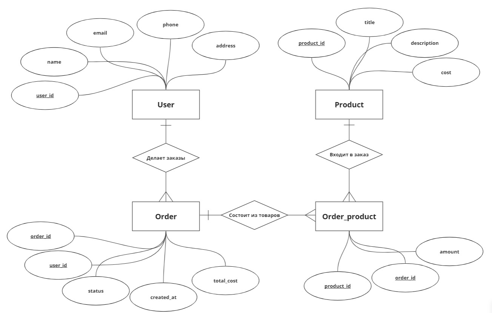
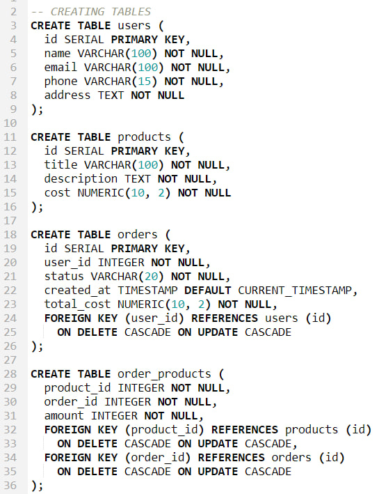
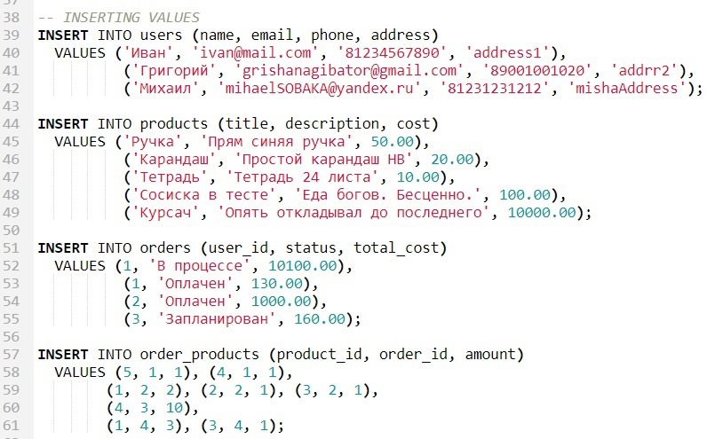
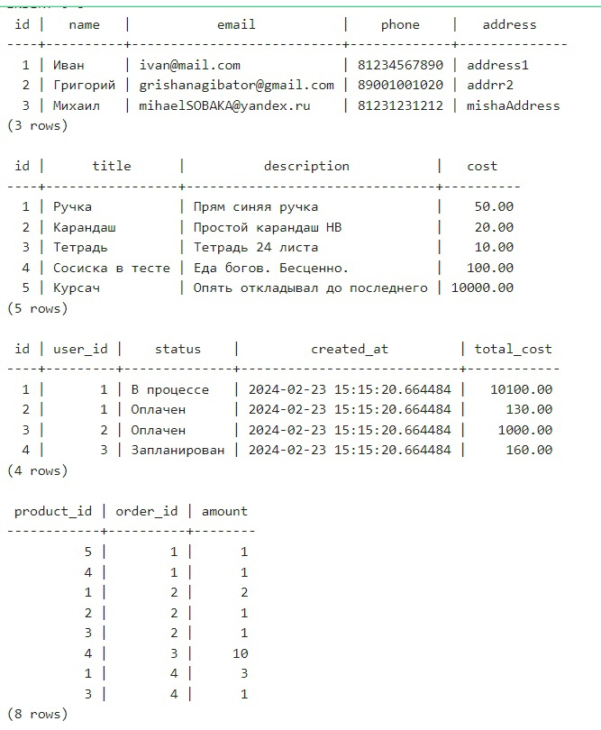
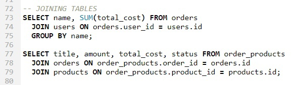
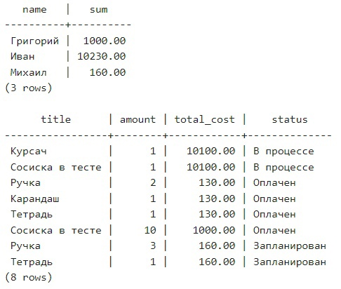
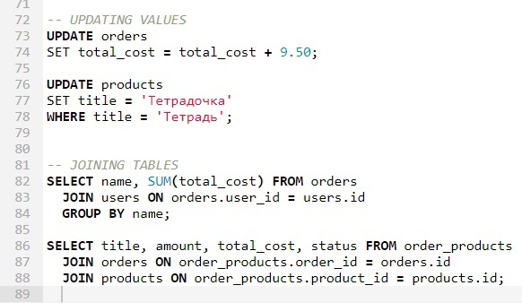
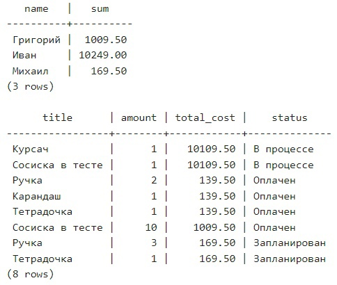
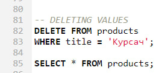
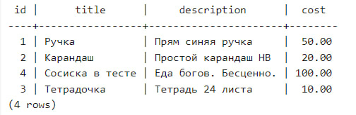

# Диаграмма "Сущность-связь"

# Реализация в онлайн-сервисе https://onecompiler.com/postgresql

### Создание таблиц

### Запись в таблицы

### Вывод данных

Чтобы вывести все значения по каждой таблице, используем команду  
`SELECT * FROM <название_таблицы>;`  

### Объединение таблиц

 

### Изменение данных

 

### Удаление данных

 

