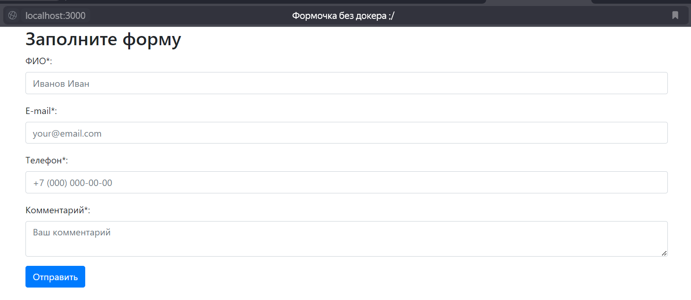
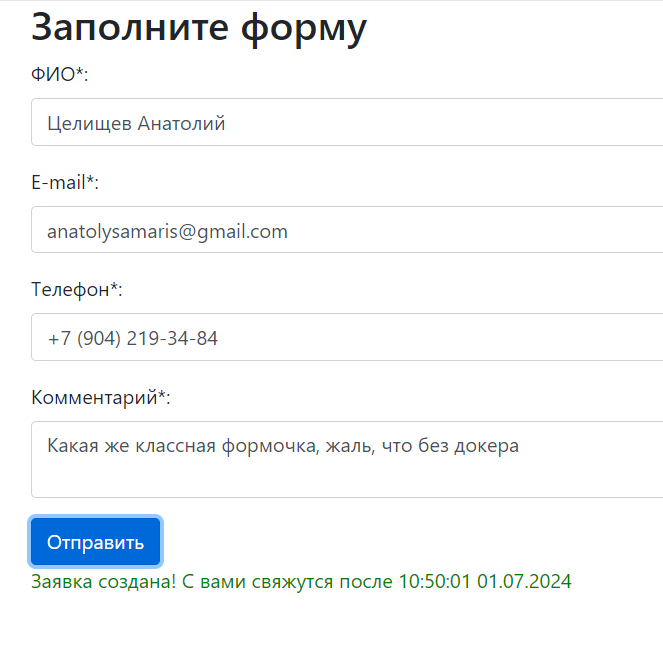
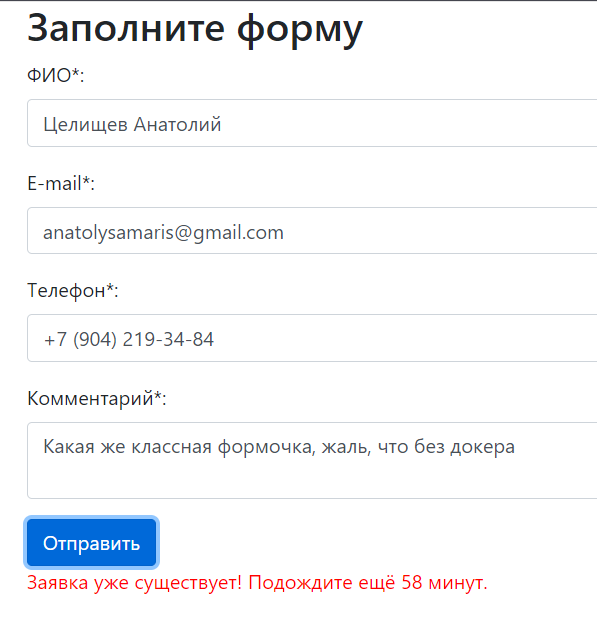
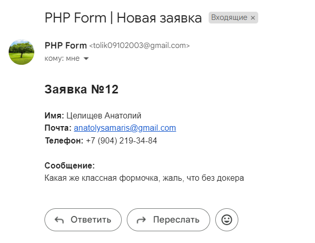

## Начальный экран

## Введем некоторые данные, создадим заявку
Об успехе свидетельствует зеленое сообщение под формой с указанием времени, после которого с пользователем свяжутся
(время создания заявки + 1,5 часа)

## Попробуем создать заявку ещё раз для того же email

## Проверим, что данные из формы отправлены на почту менеджеру

