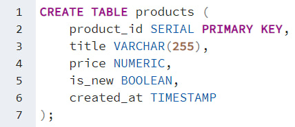
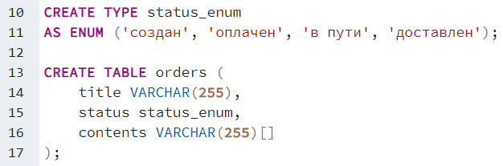
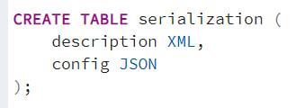
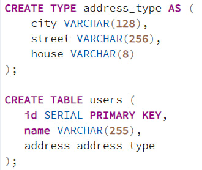
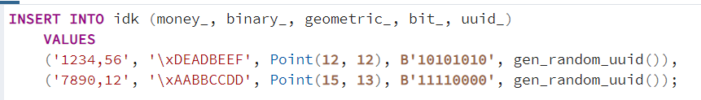
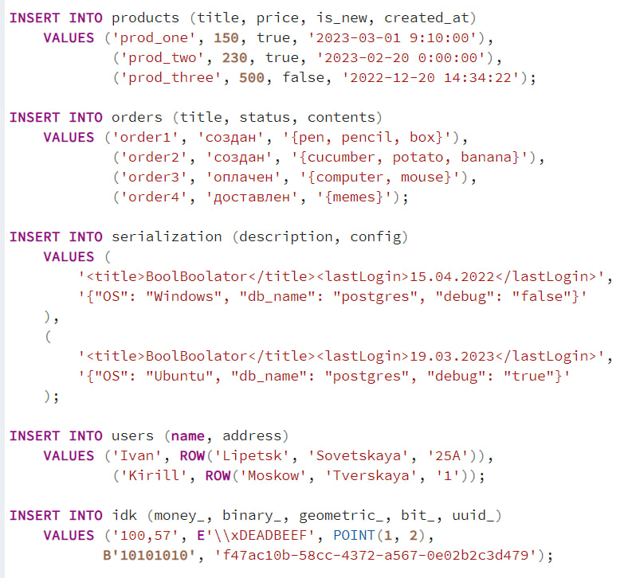
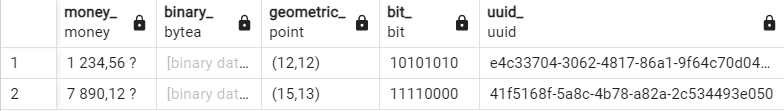
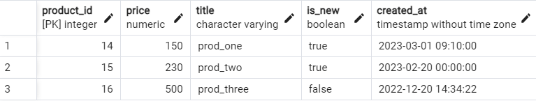
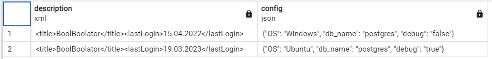

# Создание таблиц

### Таблица со стандартными типами данных

### Таблица с перечислением и массивом

### Таблица с XML и JSON

### Таблица с составным типом данных

### Таблица с иными типами данных

# Вставка данных в созданные таблицы

# Вывод таблиц

idk:

orders:

products:

serialization:

users:

