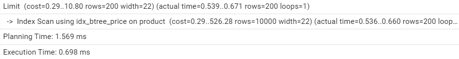

# Создание таблицы для работы

# Анализ запросов

### Страница товара

### Список товаров по умолчанию

### Список товаров, сортировка по цене

### Список товаров, выбранный менеджером

### Поиск товаров по названию

### Поиск товаров, которые скоро закончатся

# Запросы с индексами

### B-tree, поиск товаров, которые скоро закончатся

### B-tree, сортировка товаров по цене

### Hash-индекс, поиск товаров по названию

### Patrial-индекс, сортировка товаров по цене

